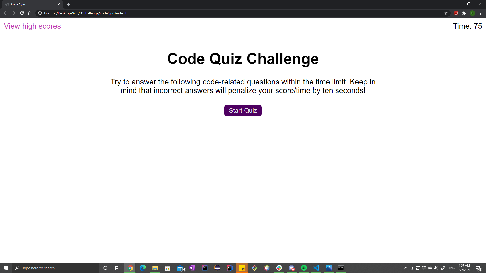
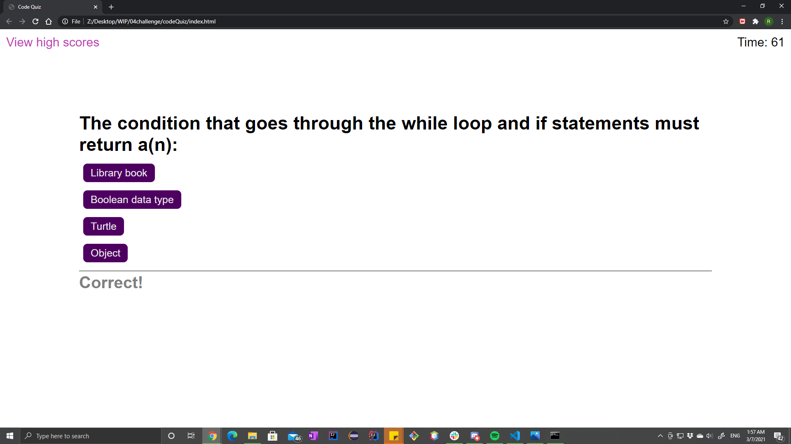
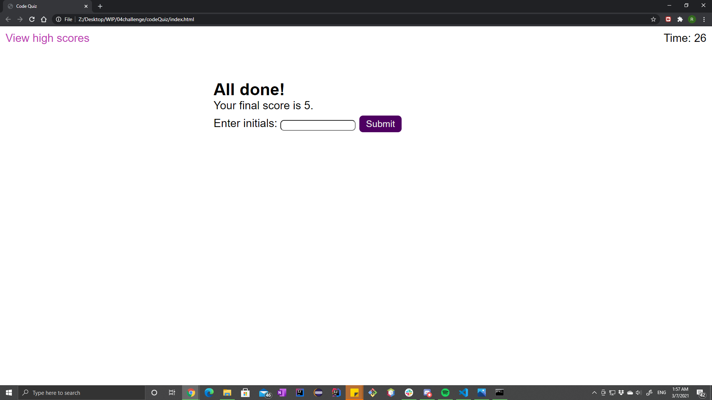
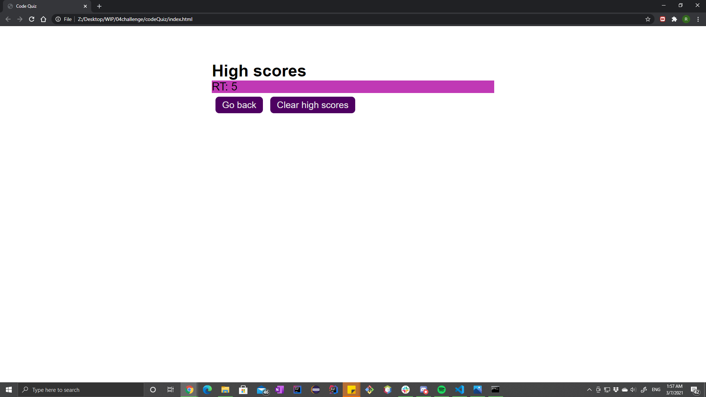

# Code Quiz

## Purpose
Create a website that can quiz about coding.
The users can save their scores on the local storage of their browser

## Demo

## Built With
* HTML
* CSS
* JavaScript

## Website
 https://raytakemura.github.io/codeQuiz/.

## Contribution
Ray Takemura

&copy; Ray Takemura